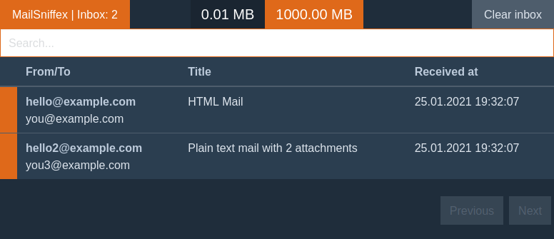

# MailSniffex

Email testing tool for developers. Works as a SMTP server to catch sent mails and provides a web interface to browse them. Saves a mail data into local `data` directory. Inspired by MailHog and MailCatcher. 

## Dependencies
  * iconv
  * OpenSSL

## ENV options
  * PORT - default 4000 - web ui port
  * SMTP_PORT - default 2525 - SMPT server port
  * SIZE_LIMIT - default 1GB - limits the size of the storage for mails. After passing this limit the app will start removing oldest mails until the size will be under the limit again. Accepts MB and GB postfix (for example 4GB, 100MB).

## Docker
Available on [Docker Hub](https://hub.docker.com/r/adrid/mailsniffex)
  

## TODO
  * Downloading an original email
  * Handle displaying of embeded images
  * Removal of a single mail
  * Show CC, BCC, Reply To and priority fields
  * JSON API
  * More tests
  * Optional sending of messages to a real SMTP server
